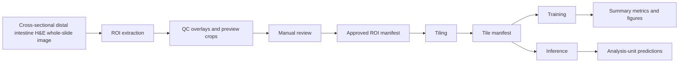

# Workflow Overview

This repository documents a weakly supervised workflow for rainbow trout distal intestine H&E whole-slide histology. The current public version is limited to code, configuration templates, summary results, and selected representative figures.

## End-To-End Workflow

## Main Stages

### Slide Intake

- Input slides remain outside the public repository.
- Public manifest templates show the expected schema but do not contain real data.
- The current trained models assume rainbow trout distal intestine H&E whole-slide histology.

### ROI Extraction

- Script: `scripts/preprocess_extract_rois.py`
- Purpose: detect tissue components and export review-ready ROIs
- Main outputs:
  - `qc_overlays/`
  - `preview_crops/`
  - `manifests/roi_manifest.csv`
  - `manifests/roi_issues.csv`

### Manual QC

- Manual review is required before tiling.
- ROIs are initialized with `include_for_tiling = 0`.
- Only approved ROIs should proceed to the tiling step.

### Tiling

- Script: `scripts/preprocess_tile_rois.py`
- Purpose: create model-ready tiles from approved ROIs
- Main outputs:
  - `tiles/...`
  - `manifests/tile_manifest.csv`
  - `manifests/tiling_summary.csv`

### Training

- Script: `scripts/train.py`
- Purpose: train tile-level models and summarize performance at both tile and analysis-unit levels
- Public examples currently cover:
  - binary enteritis
  - mononuclear infiltration, five levels
  - mononuclear infiltration, collapsed binary

### Inference

- Script: `scripts/infer.py`
- Purpose: score tiles from a tile manifest and aggregate predictions to the analysis-unit level
- Inference requires a user-supplied checkpoint. No weights are distributed here.
